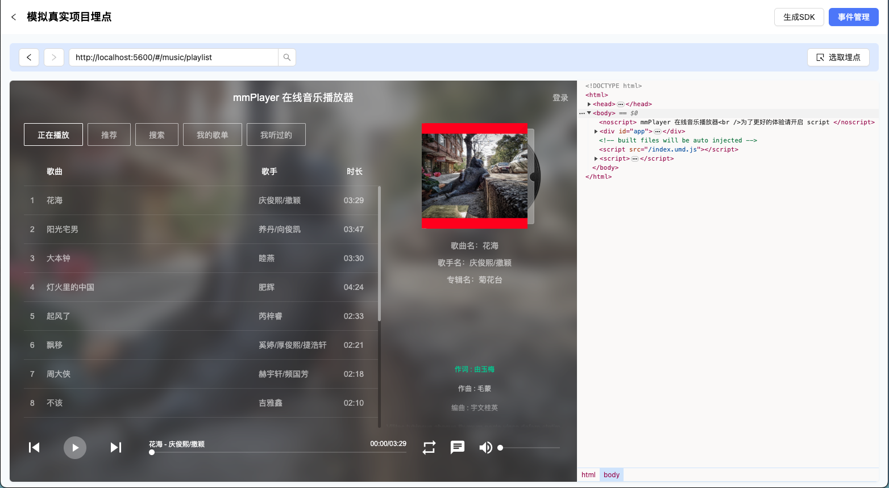
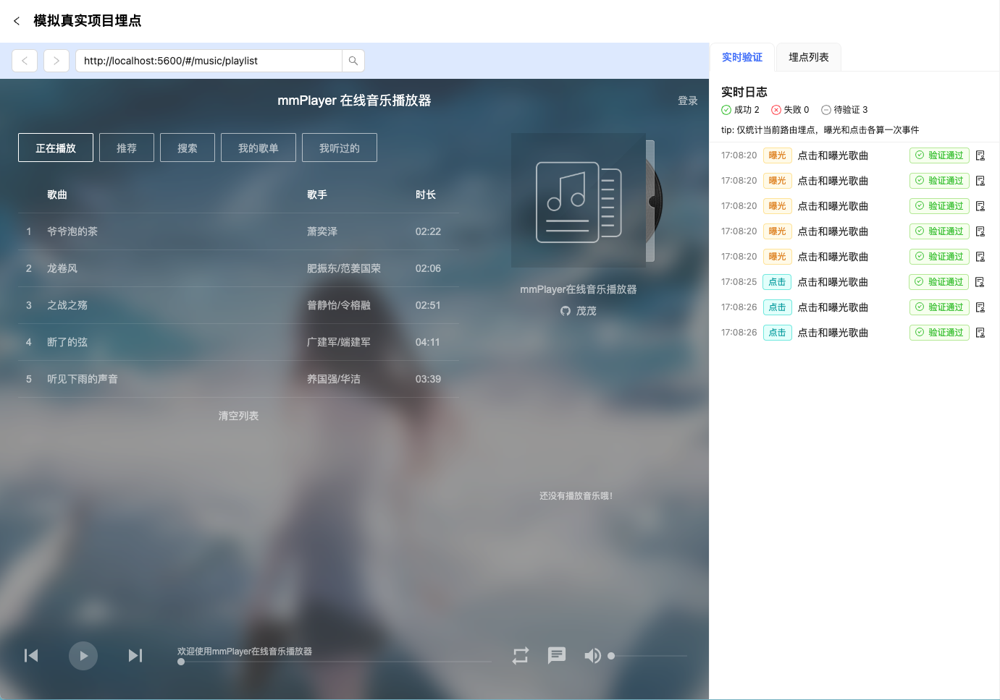
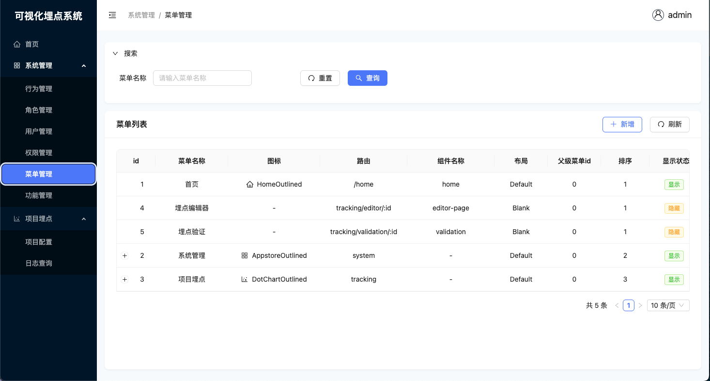
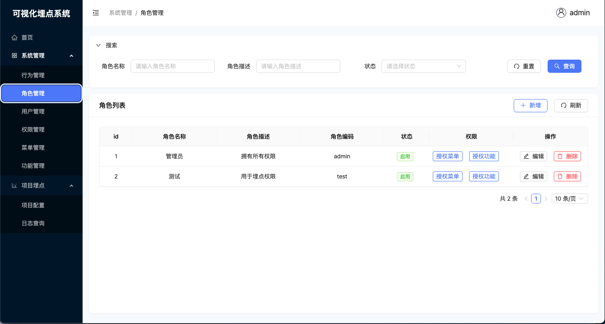

# visual-event-tracking


<p align="center">

**English** · [简体中文](./README.md)

</p>

## Introduction

This project provides a complete visual event tracking solution, including:

- **SDK Component**: A lightweight tracking SDK that supports automatic exposure detection and click event collection.
- **Management Backend**: A visual configuration platform for tracking, supporting menu management, data validation, and RBAC permission control.
- **NestJS Backend**: Provides complete capabilities for collecting, storing, and querying tracking data, supporting RESTful API interfaces.

It also utilizes a variety of mainstream front-end development technologies, including React 18, Vite 5, TypeScript, Unocss, Rollup, SWC, esbuild, and Turbo. The backend is built using NestJS microservices, the database is PostgreSQL, the message queue employs Kafka, and log storage utilizes ClickHouse.

## Demo Video

[<video controls src="https://github.com/IFreeOvO/visual-event-tracking/resources/videos/demo.mp4" muted="false"></video>](https://github.com/user-attachments/assets/d4ebb856-80f6-4754-9d27-12a2a049bacb)

## Online Experience

[Demo Link](https://ifreeovo.github.io/visual-event-tracking)

> The online link only provides mock interfaces, and the tracking functionality is not available. It is recommended to run the project locally to experience the full functionality.

## Screenshots






## Features

- 🚀 **Tracking Capabilities**

    - Automatically collects page exposure and element click events.
    - Supports XPath positioning and element snapshots.
    - Provides real-time log validation.

- 🔐 **RBAC Permission System**

    - Role-based access control for both front-end and back-end.
    - Fine-grained permission management.
    - Supports dynamic permission allocation and dynamic menu configuration.

- 📁 **Large File Chunk Upload**

    - Supports web worker multi-threaded concurrent slicing.
    - Front-end slicing + back-end merging mechanism.

- 🧩 **Microservices Architecture**
    - Front-end and back-end separation design.
    - RESTful API based on NestJS.
    - Kafka message queue support.
    - ClickHouse high-performance log storage and analysis.

## Installation

```bash
# Clone the project
git clone https://github.com/IFreeOvO/visual-event-tracking
# Enter the project directory
cd visual-event-tracking
# Install dependencies
pnpm install
```

## Usage

> If you have your own PostgreSQL and Kafka, you can skip steps 1-4.

### 1. Open `/resources/docker/kafka-and-database.docker-compose.yml`

Modify the `KAFKA_ADVERTISED_LISTENERS` configuration, replacing `EXTERNAL://0.0.0.0:9093` with your local IP or public IP. For example, `EXTERNAL://192.6.6.6:9093`.

### 2. Run the docker-compose command in the `/resources/docker` directory

```bash
docker-compose -f kafka-and-database.docker-compose.yml up -d
```

After execution, PostgreSQL, Kafka, and ClickHouse services will automatically start.

### 3. In the `apps/server` directory, execute the script

```bash
pnpm init-postgresql
```

Initialize the PostgreSQL database and insert default data.

### 4. Configure the Kafka service for NestJS

Create a `.env.local` file in the `apps/log-microservice` directory and add the following configuration:

```bash
kafka_brokers=xxx.xxx.xxx.xxx:xxxx # Local or public Kafka service IP address. For example, 192.6.6.666:9093
```

### 5. Configure the email service

Create a `.env.local` file in the `apps/server` directory and add the following configuration:

```bash
# Email SMTP
smtp_host = smtp.qq.com
smtp_port = 587
smtp_user = xxxxxxxxx@qq.com
smtp_pass = xxxxxxx
```

### 6. Start the project

```bash
pnpm dev
```

## Docker Deployment

The root directory of this project provides a `docker-compose.yml` file for quickly packaging monorepo sub-projects into images for deployment in production environments.

To ensure a smooth deployment, please check the following configurations before running the `docker-compose.yml` file:

#### Kafka Configuration

Check if the IP address in the `KAFKA_ADVERTISED_LISTENERS: PLAINTEXT://kafka:9092,EXTERNAL://xxx.xx.x.x:9093` configuration is correct.

#### In the log-microservice directory

Check if the `.env.production` file includes the following parameters:

```bash
# Kafka service configuration
kafka_brokers=xx.x.x.x:9093 # Must match the EXTERNAL configuration of the Kafka service.

# PostgreSQL related configuration
postgresql_host=192.x.x.x

# ClickHouse service configuration
clickhouse_url=http://192.x.x.x:8123

# Nest service configuration
tcp_host=0.0.0.0 # Or the container name (if using the container name, it needs to share the Docker network with the server service).
```

#### In the server directory

Check if the `.env.production` file includes the following parameters:

```bash
# Email SMTP
smtp_host = smtp.qq.com
smtp_port = 587
smtp_user = xxxxx@qq.com
smtp_pass = xxxxx

# Nest service configuration
server_host=http://192.x.x.x

# PostgreSQL related configuration
postgresql_host=192.x.x.x

# Redis related configuration
redis_host=192.x.x.x

# Log microservice configuration
log_microservice_host=192.x.x.x

# CORS configuration
front_end_domain=http://192.x.x.x:5600,http://192.x.x.x:8000
```

#### In the website directory

Check if the `.env.production` file includes the following parameters:

```bash
# Request configuration
VITE_REQUEST_BASE_URL=http://192.x.x.x:3000/api/v1

# Back-end service domain name
VITE_DEVTOOL_URL=http://192.x.x.x:3000/api/v1/devtools-frontend/devtools_app.html
VITE_DEVTOOL_WEBSOCKET_URL=192.x.x.x:3000/api/v1/remote/devtool
```

After confirming that all configurations are correct, execute `docker-compose up -d` to package the image.

## Tracking Considerations

- If you want to track elements in a list (usually items rendered in a loop), it is recommended to configure `Same Level Element Effect`, so that sibling elements of the tracked element can also apply the current tracking configuration without having to track each one manually.
- When tracking list elements, be sure to select the outermost tag of the item component. Otherwise, even if you configure `Same Level Element Effect`, it will not be able to find sibling elements of the tracked object.
- It is best to keep the class names of item components in the list consistent, as the code determines whether they are the same component based on class names. For example, if all item components in the list have a root element class name of `.card`, the code will consider them as sibling elements of the tracked element. Conversely, if the root element class names of item components are `.card-1`, `.card-2`, and so on, the code will consider them as different sibling elements. This judgment is made because a common scenario in lists is that when the list data is not fully loaded, scrolling the list will show a `Loading` message, and when the list data is fully loaded, a `Reached the Bottom` message usually appears at the bottom. The `Loading` and `Reached the Bottom` messages are likely placed at the same level as the item, leading to misjudgment. Fortunately, the class names of `Loading` and `Reached the Bottom` messages are different from the item component class names, so the code uses class names as the basis for determining whether the component has changed.
- Tracking configurations are only effective for the current route. For example, if both interface A and interface B have the same banner in the same layout position, you need to track the banner for interface A and the banner for interface B separately. If you only track the banner for interface A, when switching to interface B, the banner for interface B will not have any tracking events.

## Open Source License

[MIT](./LICENSE)
