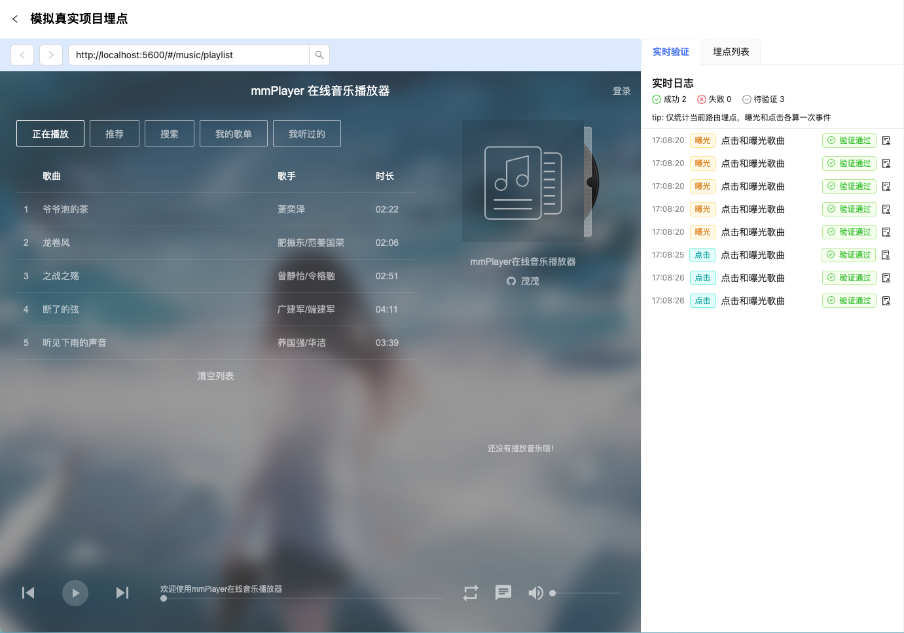
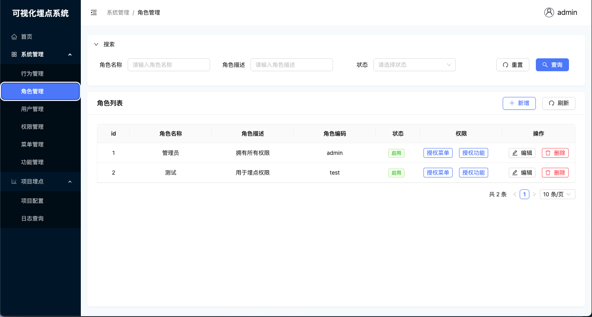

# visual-event-tracking


<p align="center">

**简体中文** · [English](./README.en.md)

</p>

## 简介

本项目提供完整的可视化埋点解决方案，包含：

- **SDK组件**：轻量级埋点采集SDK，支持自动曝光检测和点击事件采集
- **管理后台**：可视化埋点配置平台，支持菜单管理、数据验证和RBAC权限控制等
- **nestjs后台**：提供完整的埋点数据收集、存储和查询能力，支持RESTful API接口

同时采用了大量前端主流开发技术，react18、Vite5、TypeScript、Unocss、Rollup、SWC、esbuild、turbo等。后端使用NestJS微服务，数据库采用PostgreSQL，消息队列采用Kafka，日志存储采用ClickHouse。

## 演示视频

https://github.com/user-attachments/assets/d4ebb856-80f6-4754-9d27-12a2a049bacb

## 在线体验

[demo地址](https://ifreeovo.github.io/visual-event-tracking)

> 在线地址仅提供mock接口，埋点功能不可用。建议在本地运行项目，以体验完整功能

## 截图






## 功能特性

- 🚀 **埋点采集能力**

    - 自动采集页面曝光和元素点击事件
    - 支持XPath定位和元素快照
    - 提供日志实时验证

- 🔐 **RBAC权限系统**

    - 前后端基于角色的访问控制
    - 细粒度的权限管理
    - 支持权限动态分配、菜单动态配置

- 📁 **大文件分片上传**

    - 支持web worker多线程并发切片
    - 前端切片+后端合并机制

- 🧩 **微服务架构**
    - 前后端分离设计
    - 基于NestJS的RESTful API
    - Kafka消息队列支持
    - ClickHouse高性能日志存储与分析

## 安装

```bash
# 下载项目
git clone https://github.com/IFreeOvO/visual-event-tracking
# 进入项目目录
cd visual-event-tracking
# 安装依赖
pnpm install
```

## 使用方式

> 如果有自己的postgreSQL和kafka可以跳过步骤1~4

### 1.打开/resources/docker/kafka-and-database.docker-compose.yml

修改`KAFKA_ADVERTISED_LISTENERS`配置，将`EXTERNAL://0.0.0.0:9093`替换成你本机的IP或公网IP。例如`EXTERNAL://192.6.6.6:9093`

### 2.在/resources/docker目录运行docker-compose命令

```bash
docker-compose -f kafka-and-database.docker-compose.yml up -d
```

执行完，会自动启动postgreSQL、kafka和clickhouse服务

### 3.在`apps/server`目录下，执行脚本

```bash
pnpm init-postgresql
```

初始化postgreSQL数据库，并插入默认数据

### 4.配置nestjs的kafka服务

在`apps/log-microservice`目录下创建`.env.local`文件，添加以下配置：

```bash
kafka_brokers=xxx.xxx.xxx.xxx:xxxx # 本地或公网kafka服务ip地址。例如192.6.6.666:9093
```

### 5.配置邮箱服务

在`apps/server`目录下创建`.env.local`文件，添加以下配置：

```bash
# 邮箱smtp
smtp_host = smtp.qq.com
smtp_port = 587
smtp_user = xxxxxxxxx@qq.com
smtp_pass = xxxxxxx
```

### 6.启动项目

```bash
pnpm dev
```

## docker部署

本项目根目录下提供了`docker-compose.yml`文件，方便快速打包monorepo子项目为镜像，部署到生产环境中。

为了保证部署顺利，运行`docker-compose.yml`文件前。请检查以下配置是否正确引入：

#### kafka配置

检查`KAFKA_ADVERTISED_LISTENERS: PLAINTEXT://kafka:9092,EXTERNAL://xxx.xx.x.x:9093`配置里`EXTERNAL`的IP地址是否正确。

#### log-microservice目录下

检查`.env.production`文件是否引入以下参数

```bash
# kafka 服务配置
kafka_brokers=xx.x.x.x:9093 # 一定要和kafka服务的EXTERNAL配置保持一致

# postgresql 相关配置
postgresql_host=192.x.x.x

# clickhouse 服务配置
clickhouse_url=http://192.x.x.x:8123

# nest 服务配置
tcp_host=0.0.0.0 # 或者是容器名(如果是容器名，需要和server服务共享docker网络)
```

#### server目录下

检查`.env.production`文件是否引入以下参数

```bash
# 邮箱smtp
smtp_host = smtp.qq.com
smtp_port = 587
smtp_user = xxxxx@qq.com
smtp_pass = xxxxx

# nest 服务配置
server_host=http://192.x.x.x

# postgresql 相关配置
postgresql_host=192.x.x.x

# redis 相关配置
redis_host=192.x.x.x

# log微服务配置
log_microservice_host=192.x.x.x

# cors 配置
front_end_domain=http://192.x.x.x:5600,http://192.x.x.x:8000

```

#### website目录下

检查`.env.production`文件是否引入以下参数

```bash
# 请求配置
VITE_REQUEST_BASE_URL=http://192.x.x.x:3000/api/v1

# 后端服务域名
VITE_DEVTOOL_URL=http://192.x.x.x:3000/api/v1/devtools-frontend/devtools_app.html
VITE_DEVTOOL_WEBSOCKET_URL=192.x.x.x:3000/api/v1/remote/devtool
```

以上配置都确认没问题后，再执行`docker-compose up -d`打包镜像。

## 埋点注意事项

- 如果希望给列表里的元素进行埋点(一般是列表里循环渲染的item)，推荐配置`同级元素生效`，这样埋点元素的兄弟元素也能应用当前埋点配置。不必一个个进行手动埋点
- 给列表元素埋点时，一定要选中item组件最外层的标签。否则即使配置`同级元素生效`，也无法找到埋点对象的兄弟元素
- 列表里item组件的类名最好保持一致，因为代码里是根据类名判断你是否是相同组件。比如里列表里所有item组件的根元素类名为.card，此时代码会视为埋点元素的同级元素。反之如果item组件的根元素类名为.card-1、.card-2为此类推，则代码认为他们不是同级元素。为什么这样判断呢？因为列表里有一种常见场景是，列表数据没加载完时，滑动列表会出现`加载中`，如果列表数据加载完毕，底部一般出现`已到底部`的提示，而`加载中`和`已到底部`提示很可能被放置在跟item同级的位置，造出误判。不过好在`加载中`和`已到底部`的类名和item组件类名是不同的，所以代码以类名为依据，判断组件是否变了
- 埋点配置只对当前路由有效。例如界面A和界面B，在相同的布局位置都有一样banner，那么需要对界面A的banner和界面B的banner分别埋点一次。如果只对界面A的banner埋点，当界面切换到界面B，界面B的banner是没有任何埋点事件的

## 开源许可证

[MIT](./LICENSE)
